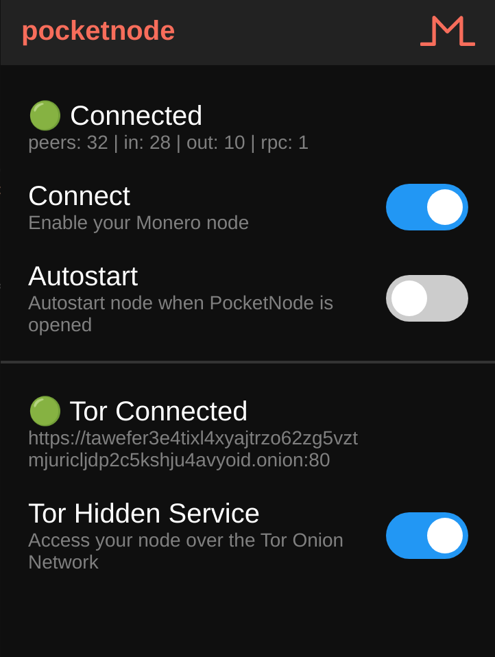

# Monero PocketNode

WORK IN PROGRESS.  USE AT YOUR OWN RISK.  PR'S WELCOME!  I DON'T KNOW HOW TO WRITE ANDROID APPS.

Forked this project from an Aeon/Wownero repo.  I was able to get it running in Android Studio on a Google Pixel phone in combination with the Android ARMv8 Monerod binary.  Please feel free to replace the existing binary in the repo (monerod64) with your own. 

The app has a pretty poor/ugly yet functional existing UI, but I would like to take it in this direction from a style standpoint:

 
<figure>

<figcaption>Inspiration</figcaption>
</figure>

Monero node for your Android phone. This is monerod packaged in an Android App. 

## Installation from github binaries

Make sure you enabled unknown sources in Android configuration (settings -> Security).

Download the app from the release section.

## Build it yourself

If you want to build the app yourself, the first thing is to get the Monero Android binaries on github, then build binaries for arm64-v8a and armeabi, and then replace the compiled monerod binary under res/raw.

res/raw/monerod32 is the arm 32 bit compiled daemon, and res/raw/monero64 is the 64 bit one.

Then import and build with android studio.  

## Phone requirements
A 64 bit processor with 2 Gb of storage is recommended to run on the mainnet blockchain.

## Wallet connection
When the node is synchronized and running, a wallet app can connect locally to check and process payements.
Running a node locally is much safer than using a public node.  

## Tips
If your phone gets pretty hot during synchronization, go to "settings" -> "Limit rate" and set a value around 50 kB/s. This will reduce CPU usage but will make synchronization slower....  